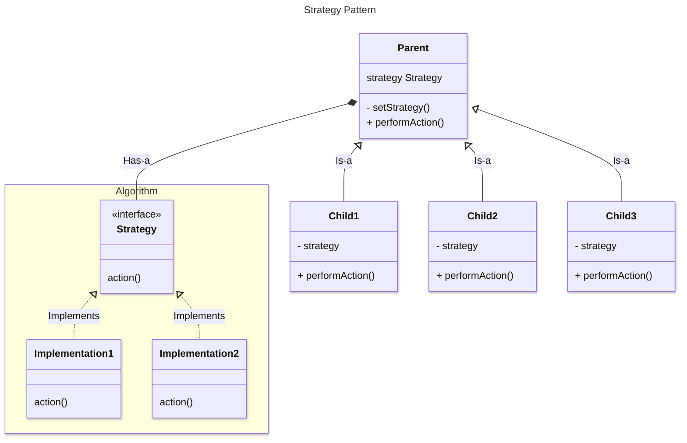

# 000-000-00B: Strategy pattern

This pattern extract the implementation of multiple behaviours out of a parent class into a separate family of Interface-Traits hierarchy.
The strategy is then incorporated into the parent class through composition, and the parent delegates the action to it.
 The child class set the concrete strategy as property, making thus the chosen algorithm interchangeable.

## connections:
<!-- Example
[anchor]: <link> "title"
-->
